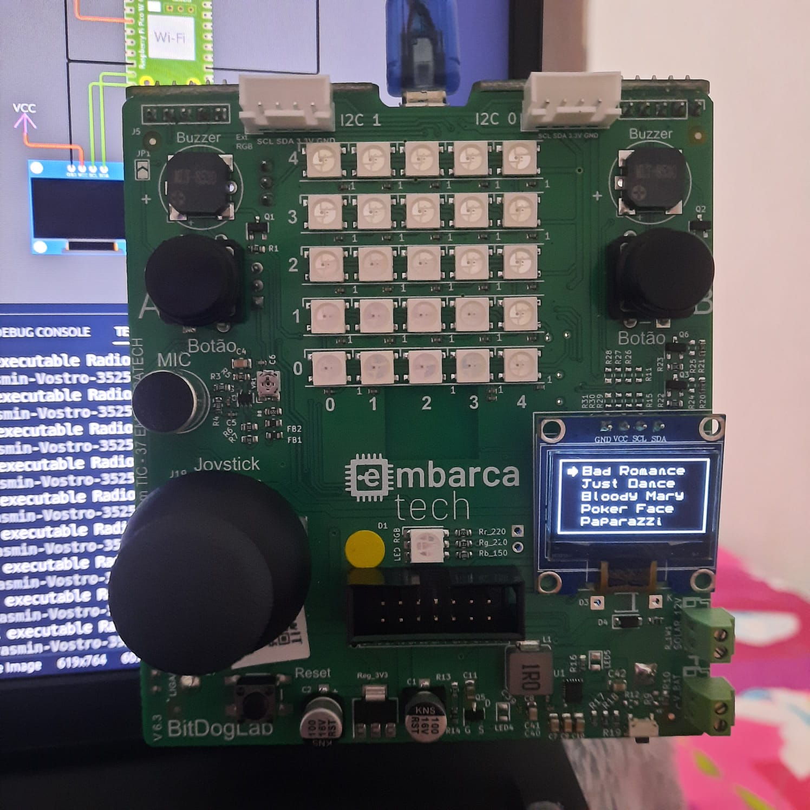
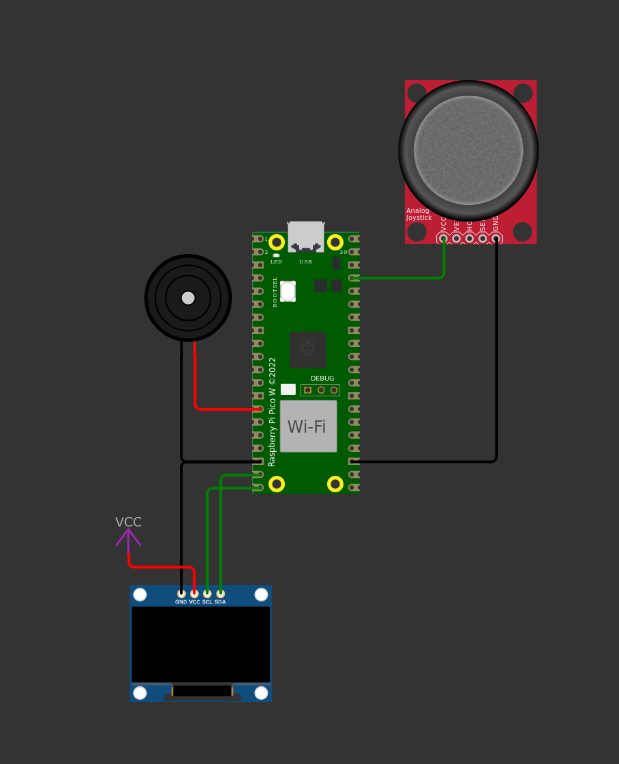

<div align="center">
    
</div>

<br>


<div align="center">

# Radio GAGA

</div>

## Descrição
O projeto utiliza o joystick da placa bitdoglab para controlar um menu de músicas no display OLED. O programa possibilita que o usuário navegue pelo catálogo de músicas da cantora Lady Gaga e escolha uma dentre as opções disponíveis.

## **Funcionalidades**  

- **Menu Interativo no Display SSD1306:** O display exibe uma lista de músicas disponíveis, permitindo navegação através do joystick. A opção selecionada é destacada visualmente.  
- **Seleção de Músicas via Joystick:** O botão do joystick permite escolher e reproduzir a música atualmente selecionada no menu.  
- **Reprodução de Músicas com Buzzer:** O buzzer toca a música correspondente à opção escolhida no menu, utilizando uma tabela de notas armazenadas em arrays.  
- **Execução Multithreaded:** A reprodução das músicas ocorre em um core separado do processador, garantindo que o menu continue responsivo.  
- **Sistema de Interrupção para Botões:** O botão **B** entra no modo de boot USB, enquanto o botão do **joystick** seleciona e toca a música destacada.  
- **Prevenção de Condições de Corrida:** A variável `song` é gerenciada para evitar a execução de músicas aleatórias ou repetidas sem comando do usuário.

## **Detalhes de Implementação**  

- **Uso do Display SSD1306 via I2C:** O display OLED de 128x64 pixels é atualizado dinamicamente para exibir o menu de seleção de músicas. As opções são redesenhadas apenas quando há mudança, evitando processamento desnecessário.  
- **Controle do Joystick Analógico:** Os valores do joystick são lidos via ADC para determinar a movimentação no menu. Um pequeno delay é aplicado para evitar mudanças excessivamente rápidas na seleção.  
- **Sistema de Interrupções para Botões:** As interrupções são configuradas para detectar pressionamentos dos botões físicos. O botão **B** ativa o modo de boot USB, enquanto o botão do **joystick** define a música a ser tocada.  
- **Reprodução de Músicas via PWM no Buzzer:** As músicas são armazenadas como arrays de frequências e durações, sendo tocadas sequencialmente através da modulação de largura de pulso (PWM) no pino do buzzer.  
- **Execução Multithreaded com o Core 1:** A reprodução das músicas ocorre em uma thread separada no segundo núcleo do Raspberry Pi Pico, evitando bloqueios na execução do menu.  
- **Gerenciamento da Variável `song`:** Após iniciar a reprodução de uma música, a variável `song` é zerada apenas após sua execução completa, prevenindo a reprodução contínua ou aleatória de músicas não selecionadas.

<p align="center">
  
  
</p>

## Testes

[Vídeo de demonstração](https://youtu.be/VnwUDhbZ-cA)

## Instruções de Uso

1. **Clonar o Repositório**:

```bash
git clone https://github.com/yasmincsme/embarcatech-U4C4-Interrupcoes.git
```

2. **Compilar e Carregar o Código**:
   No VS Code, configure o ambiente e compile o projeto com os comandos:

```bash	
cmake -G Ninja ..
ninja
```

3. **Interação com a Placa**:
   - Conecte a placa ao computador.
   - Clique em run usando a extensão do raspberry pi pico.

---
### Autora:
Yasmin Cordeiro de Souza Meira